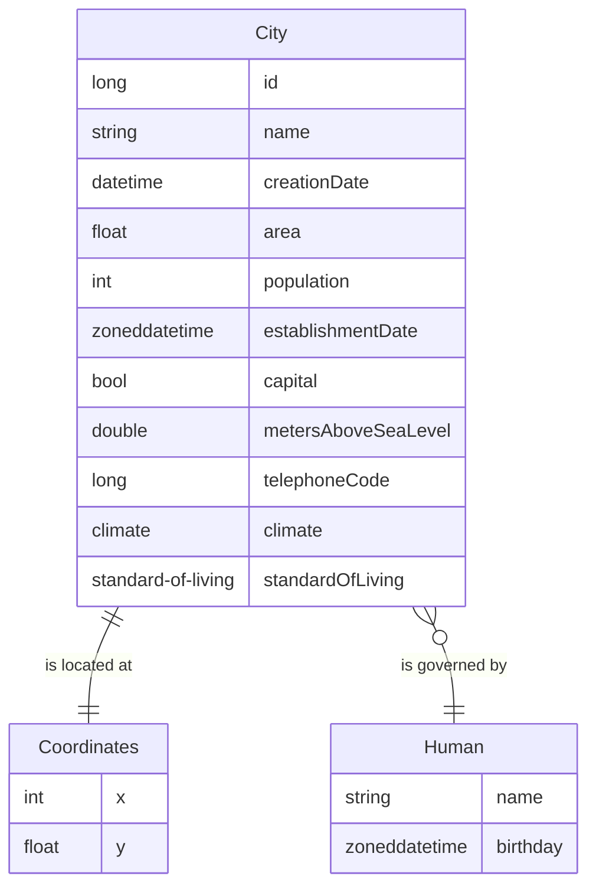

# ER диаграмма

ER диаграмма, описывающая сущности в заданной предметной области (объект `City`)

## Допущения

- Для объекта `Human` добавлено поле `name` для разнообразия (ограничения: не null, строка не пуста).
- Будем считать, что один человек может управлять одним городом, несколькими городами или не управлять никаким городом.
- Связь `City` <-> `Coordinates` делается жёсткой, так как несколько городов не могут иметь одинаковые координаты.
- Требование о привязки существующих вспомогательных объектов при создании нового объекта будет выполнено через класс `Human`.
- Требование об удалении привязанных вспомогательных объектов будет выполнено через класс `Coordinates`.
